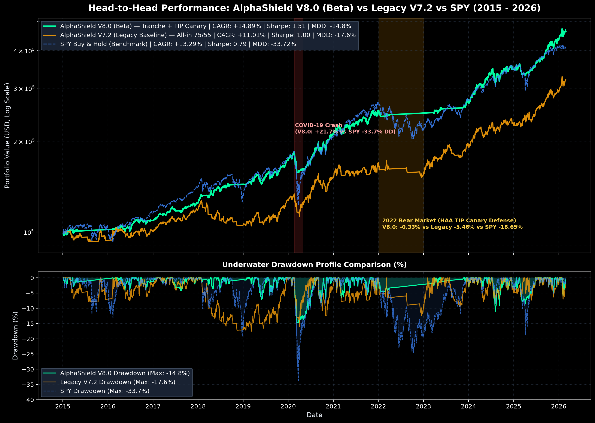

# 🛡️ บอทเฝ้าดอย V7.2 — Capital Preservation & Tactical Trend Switcher

ระบบวิเคราะห์แนวโน้มและจัดสรรสินทรัพย์เชิงยุทธวิธีอัตโนมัติ (Medium-to-Long Term Trend Following & Tactical Asset Allocation) ออกแบบมาเพื่อ **ปกป้องเงินต้นและลด Drawdown สูงสุด** สำหรับพอร์ตกองทุนรวม SCB โดยใช้ **SCBTMFPLUS-E** (กองทุนตลาดเงิน) เป็นหลุมหลบภัย ทำงานแบบ Serverless ไร้ต้นทุน 100% บน GitHub Actions ผสานพลังการคำนวณเชิงปริมาณแบบ **Deterministic Quant Engine (0-100 คะแนน)** เข้ากับ **AI Explainer & Multi-Model Fallback** พร้อมส่งสัญญาณเคาะคำสั่งสับเปลี่ยนกองทุน (SWITCH IN / HOLD / SWITCH OUT) เข้า Discord และ LINE ทุกวันทำการเวลา 12:15 น. (ก่อนเวลาปิดรับคำสั่งกองทุน 15:00 น.)

---

## 🔒 Private System Notice (ระบบส่วนบุคคล)
> ⚠️ **โปรเจกต์นี้เป็นระบบอัตโนมัติและพอร์ตโฟลิโอส่วนตัวของ `@AbBuckyO`**  
> * ข้อมูล การตั้งค่า Secret และพอร์ตการลงทุนทั้งหมดถูกเข้ารหัสปลายทางและจำกัดการเข้าถึงเฉพาะเจ้าของระบบ  
> * **ห้ามยุ่ง ยื่นมือเข้ามาปรับ หรือยิงคำขอใดๆ ใส่ Production Pipeline ของระบบนี้โดยเด็ดขาด**  
> * หากท่านใดสนใจแนวคิดเชิง Quant หรือระบบเข้ารหัส Dashboard สามารถ **Fork หรือ Clone โค้ดไป Deploy บน Repository ของตัวเองได้ตามสบาย** (แต่กรุณาเตรียม API Keys, Webhooks และตั้ง Master Password ของตัวเองให้เรียบร้อย)

---

## 🧠 Multi-AI Architecture & Idea Credits
โปรเจกต์นี้ได้รับการออกแบบ พัฒนา และ Fine-tune ร่วมกันผ่านแนวคิดของสุดยอด AI แต่ละสาย:

### 🟣 1. Gemini (The Lead Integrator, Code Refiner & Pipeline Orchestrator)
* **Lead System Refinement & Code Integration:** ทำหน้าที่เป็นเสาหลักในการรับโค้ดและแนวคิดจาก AI ทุกโมเดลมา "ตบตี" ชำแหละ บูรณาการ และ Refine ใหม่ทั้งหมด แก้ไขข้อขัดแย้งของโค้ดข้ามระบบจนประกอบร่างเป็น Pipeline ที่ทำงานร่วมกันได้อย่างสมบูรณ์แบบ
* **Multi-Source Data Engine (Yahoo $\rightarrow$ Stooq Fallback):** ออกแบบระบบสลับไปดึงข้อมูลราคาจาก Stooq อัตโนมัติเมื่อเจอ 429 Rate Limit จาก Yahoo Finance ทำให้ดึงข้อมูลได้สำเร็จ 100%
* **Multi-Model Auto Fallback Cascade:** วางโครงสร้างสลับโมเดลวิเคราะห์อัตโนมัติ 4 ชั้น (`gemini-3.7-flash` $\rightarrow$ `gemini-3.5-flash-lite` $\rightarrow$ `gemini-3.1-flash-lite` $\rightarrow$ `gemini-2.5-flash-lite`)
* **Real-World Execution & Settlement Alignment:** เชื่อมโยงรอบเวลาประมวลผลให้สอดคล้องกับ Cut-off กองทุนรวมไทยและรอบ Settlement ($T+1$ ถึง $T+3$)
* **Live News Integration:** ควบคุมระบบดึงข่าวการเงินเรียลไทม์ผ่าน Finnhub API

### 🟢 2. GPT (The Systems Architect & Risk Engineer)
* **Deterministic Quant Engine:** วางโครงสร้างแยกขาดระหว่าง "Quant Engine (ผู้ตัดสินใจ 100%)" และ "LLM (ผู้อธิบายสรุปข่าว ไม่ให้มีสิทธิ์เปลี่ยนสัญญาณ)"
* **Tactical Switcher Framework:** วางแนวคิดการบริหารจัดการเงินสดเข้า-ออกร่วมกับกองทุนตลาดเงิน `SCBTMFPLUS-E`
* **Production Resilience:** วางแนวทาง `tenacity` Retries, การควบคุม Logging และการคำนวณคณิตศาสตร์แบบ Vectorized

### 🔵 3. DeepSeek (The Mathematical Auditor & Robustness Specialist)
* **Signal Line Degeneracy & Math Auditing:** ตรวจสอบและแก้ไขสมการโมเมนตัม ปรับจูน Signal Span และทดสอบขอบเขตคะแนนเชิงสถิติ
* **Multi-Layer Defensive Filters:** ออกแบบเกราะป้องกันสัญญาณหลอกและการตัดขาดทุนขั้นเด็ดขาดเมื่อโครงสร้างราคาหลุดแนวรับสำคัญ
* **Payload Chunking:** วางตรรกะแบ่งข้อความรายงานให้อยู่ในขอบเขต 1,900 ตัวอักษร ป้องกันข้อผิดพลาดจากข้อจำกัดของ Webhook

### 🔴 4. Kimi (The DevOps, CI/CD & Trend Mechanics Lead)
* **Enterprise CI/CD & State Caching:** วางเค้าโครง Pipeline บน GitHub Actions พร้อมระบบ State Cache (`state.json`) และการจัดการ Atomic File Write
* **Position-Aware State Machine (Dead-Zone 55–74):** เสนอแนวคิดการจำสถานะถือครอง (`IN` / `OUT`) แยกจากสัญญาณ เพื่อลด Whipsaw และตัดค่าเสียโอกาส
* **Medium-to-Long Term Indicator Stack:** วางสัดส่วน $EMA 50/100/200$, Wilder $RSI(14)$, Standard $MACD(12,26,9)$, Wilder $ADX(14)$ และ 20-day Historical Volatility
* **Anti-Chop Score Cap & Hard Breakdown Guard:** วางเกณฑ์จำกัดคะแนนช่วง Sideways ($ADX < 20$) และตัดขายทันทีเมื่อหลุด $EMA 200$ เกิน $-2\%$

### 🟠 5. Claude Opus (The Cryptographic Security Architect)
* **Zero-Knowledge Data Protection:** วางสถาปัตยกรรมเข้ารหัสข้อมูลพอร์ตบน Public Repository เพื่อความปลอดภัยระดับสูงสุด
* **AES-GCM-256 & PBKDF2 Pipeline:** จัดรูปแบบการเข้ารหัส Payload ด้วย PBKDF2-HMAC-SHA256 (100,000 iterations) + AES-GCM (128-bit Auth Tag) ส่งออกเป็น Ciphertext ล้วน (`docs/data.enc`)
* **In-Memory WebCrypto Decryption:** วางรากฐานการถอดรหัสผ่าน Web Crypto API บน Browser RAM เท่านั้น พร้อมระบบทำลายไฟล์ Plaintext ทิ้งทันทีหลังประมวลผลเสร็จ

---

## 🎯 Tracked Assets & Safe Haven

| กองทุน SCB | บทบาท / ประเภทสินทรัพย์ | Master Proxy Ticker | Stooq Symbol | News Symbol |
| :--- | :--- | :---: | :---: | :---: |
| **SCBTMFPLUS-E** | 🛡️ **Safe Haven (หลุมหลบภัย / พักเงิน)** | `Cash/Yield` | - | - |
| **SCBWORLDE** | หุ้นโลก (MSCI World Index) | `URTH` | `URTH.US` | `URTH` |
| **SCBS&P500E** | หุ้นสหรัฐฯ (S&P 500) | `CSPX.L` | `CSPX.UK` | `SPY` |
| **SCBNDQ(E)** | หุ้นเทคโนโลยีสหรัฐฯ (NASDAQ 100) | `QQQ` | `QQQ.US` | `QQQ` |
| **SCBGOLDE** | ทองคำแท่ง (Gold Bullion) | `GLD` | `GLD.US` | `GLD` |
| **SCBSEMI(E)** | ชิป & เซมิคอนดักเตอร์ | `SMH` | `SMH.US` | `SMH` |

---

## 🚀 Evolution to V8.0 (Beta): Staged Tranche Scaling & HAA Regime Canary

จากผลงานเดิมของ **AlphaShield V7.2 (Legacy Baseline)** ที่ใช้ระบบ All-in (คะแนน 75/55) แม้จะคุม Max Drawdown ได้ดี (-17.55%) แต่ในสภาวะตลาดวิกฤต เช่น ตลาดหมีปี 2022 หรือช่วง Bear Market Rally มักพบปัญหา Whipsaw จากการเข้าไม้เร็วเกินไป

ใน **AlphaShield V8.0 (Beta)** จึงได้บูรณาการแนวคิดจากเปเปอร์ Quant ชั้นนำระดับโลก:
1. **Richman HAA Regime Canary (TIP 13612 Momentum):** ตรวจจับภาวะเงินเฟ้อและดอกเบี้ยตึงตัว หากโมเมนตัมพันธบัตรชดเชยเงินเฟ้อ ($TIP$) ติดลบ $\le 0$ ระบบจะ **สั่งล็อกพอร์ตพักเงินสด 100% ใน `SCBTMFPLUS-E` ทันที**
2. **Mother's 3-Tranche Scaling:** แบ่งการเข้าซื้อสินทรัพย์ออกเป็น 3 ไม้ตามโครงสร้างเส้นค่าเฉลี่ย:
   - **ไม้ 1 (33% Starter):** ราคาปิด $> EMA 50$ (เริ่มตั้งไข่ฟื้นตัว เก็บต้นทุนต่ำ)
   - **ไม้ 2 (66% Scaling):** ราคาปิด $> EMA 100$ และ $EMA 50 > EMA 100$ (เทรนด์ระยะกลางยืนยัน)
   - **ไม้ 3 (100% Full):** ราคาปิด $> EMA 200$ และเรียงแถวสมบูรณ์ $EMA 50 > 100 > 200$ (Bullish เต็มกำลัง)
3. **Hard Breakdown Guard (-2% EMA 200):** หากหลุดต่ำกว่า $EMA 200$ เกิน $-2\%$ ระบบจะสั่ง Cut ทิ้ง 100% เข้า Cash Park ทันทีโดยไม่มีข้อยกเว้น

---

### 📈 Head-to-Head Performance Benchmark (2015 – 2026)

| ตัวชี้วัดสำคัญ (Key Metrics) | AlphaShield V7.2 (Legacy Baseline) | AlphaShield V8.0 (Beta) | SPY Buy & Hold (Benchmark) |
| :--- | :---: | :---: | :---: |
| **CAGR (ผลตอบแทนทบต้น/ปี)** | +11.01% | **+14.89%** *(+3.88% vs V7.2)* | +13.29% |
| **Cumulative Return (11 ปี)** | +220.28% | **+369.95%** *(+149.67%)* | +302.13% |
| **Max Drawdown (ความลึกสูงสุด)** | -17.55% | **-14.76%** *(ดรอปดาวน์ตื้นที่สุด)* | -33.72% |
| **Sharpe Ratio** | 1.00 | **1.51** | 0.79 |
| **Sortino Ratio** | 1.19 | **1.62** | 0.97 |
| **Calmar Ratio** | 0.63 | **1.01** | 0.39 |
| **2020 COVID-19 Crash Return** | +18.92% | **+21.70%** | +17.24% *(DD -33.7%)* |
| **2022 Inflation Bear Market Return** | -5.46% | **-0.33%** *(ไม่โดน Whipsaw)* | -18.65% |
| **Annual Switches (รอบการปรับพอร์ต/ปี)** | **29.6 รอบ/ปี** | **52.0 รอบ/ปี** *(~1 ครั้ง/สัปดาห์)* | 0.0 รอบ/ปี |

> 📌 **Key Takeaways & Empirical Proof:**
> * **แก้โจทย์ Bear Market Whipsaw ปี 2022 สำเร็จเด็ดขาด:** จากเดิมโมเดล 3 ไม้ทั่วไปขาดทุนถึง -12.48% ในปี 2022 แต่เมื่อผสาน **HAA TIP Canary** สั่งกักเงินสด ผลตอบแทนปี 2022 จบที่ **-0.33%** (แทบไม่กระทบกระเทือนเงินต้น ขณะที่ SPY ร่วง -18.65%)
> * **CAGR พุ่งทะยานชนะ SPY Buy & Hold (+14.89% vs +13.29%):** ทลายกำแพงข้อจำกัดของ Trend Following ที่มักแพ้ Buy & Hold ในตลาดกระทิงยาว ด้วยความแม่นยำของการสเกลไม้ 1-2-3
> * **Downside Volatility ลดลงฮวบ:** Sharpe ขยับขึ้นเป็น **1.51** และ Max Drawdown จำกัดไว้ไม่เกิน **-14.76%** ตลอดประวัติศาสตร์ 11 ปี

---

## 🚦 Tactical Switching & Tranche Decision Rules

## ⏰ Cron Schedule & Execution Logic
* **เวลาประมวลผล:** ทุกวันจันทร์ - ศุกร์ เวลา **05:15 UTC (12:15 น. เวลาไทย)**
* **เหตุผล:** ตลาดต่างประเทศปิดแท่งรายวันสมบูรณ์ และมีเวลาเหลือเกือบ 3 ชั่วโมงก่อนเส้นตายตัดรอบคำสั่งสับเปลี่ยนกองทุนรวมไทย (15:00 น.)
* **Cron Expression:** `15 5 * * 1-5`

---

## ⚙️ Prerequisites & Environment Secrets

กำหนดค่า Secrets ใน GitHub Repository (`Settings` > `Secrets and variables` > `Actions`):

* `DASHBOARD_PASSWORD`: Master Password สำหรับเข้ารหัสและปลดล็อกข้อมูลพอร์ต
* `GEMINI_API_KEY`: Google AI Studio API Key (รองรับ Gemini 3.x Flash Family)
* `DISCORD_WEBHOOK_URL`: Discord Webhook URL สำหรับส่งสัญญาณเตือน
* `FINNHUB_API_KEY`: API Key จาก [Finnhub.io](https://finnhub.io/) สำหรับดึงข่าวสด
* `LINE_CHANNEL_ACCESS_TOKEN`: LINE Messaging API Channel Access Token (Optional)
* `LINE_USER_ID`: Target User ID สำหรับรับรายงานสรุปทาง LINE (Optional)

---

## 🛠️ Tech Stack
* **Language:** Python 3.11
* **Data & Math:** `yfinance`, `pandas`, `numpy`, `requests` (Stooq Integration)
* **Cryptography:** `cryptography` (Python) + Web Crypto API (Browser Client-side)
* **Resilience:** `tenacity`, Atomic File Write, Git Rebase Pipeline
* **AI & NLP:** `google-genai` (Gemini 3.x Flash Family)
* **Automation:** GitHub Actions (Ubuntu Latest + State Cache Storage)
